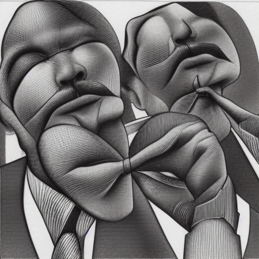

======
Bowtie
======

|

.. image:: https://img.shields.io/pypi/v/bowtie-json-schema.svg
  :alt: PyPI version
  :target: https://pypi.org/project/bowtie-json-schema/

.. image:: https://img.shields.io/pypi/pyversions/bowtie-json-schema.svg
  :alt: Supported Python versions
  :target: https://pypi.org/project/bowtie-json-schema/

.. image:: https://github.com/bowtie-json-schema/bowtie/workflows/CI/badge.svg
  :alt: Build status
  :target: https://github.com/bowtie-json-schema/bowtie/actions?query=workflow%3ACI

|

Bowtie is a *meta*-validator of the `JSON Schema specification <https://json-schema.org/>`_, by which we mean it coordinates executing *other* `validator implementations <https://json-schema.org/implementations.html>`_, collecting and reporting on their results.

To do so it defines a simple input/output protocol (specified in `this JSON Schema <https://github.com/bowtie-json-schema/bowtie/blob/main/io-schema.json>`_ which validator implementations can implement, and it provides a CLI which can execute supported implementations.

It's called Bowtie because it fans in lots of JSON then fans out lots of results: ``>·<``.
Looks like a bowtie, no?
Also because it's elegant – we hope.

For more information, see `Bowtie's documentation <https://bowtie-json-schema.readthedocs.io/>`_.
