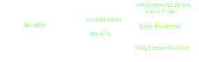

===========================
Adding a New Implementation
===========================

The purpose of `Bowtie` is to support passing :term:`instances <instance>` and :term:`schemas <schema>` through a large number of JSON Schema implementations, collecting their output for comparison.

If you've written or used an implementation of JSON Schema which isn't already supported, let's see how you can add support for it to Bowtie.

Bowtie orchestrates running a number of containers, passing JSON Schema test cases to each one of them, and then collecting and comparing results across implementations.
Any JSON Schema implementation will have some way of getting schemas and instances "into" it for processing.
We'll wrap this implementation-specific API inside a small harness which accepts input from Bowtie over standard input and writes results to standard output in the format Bowtie expects, as shown below:

As a last step before we get into details, let's summarize some terminology (which you can also skip and refer back to if needed):

.. glossary::

    implementation
        a library or program which implements the JSON Schema specification

    validation API
        the specific function(s), method(s), or similar constructs within the `implementation` which cause it to evaluate a schema against a specific instance

    host language
        the programming language which a particular `implementation` is written in

    test harness
    test runner
        a small program which accepts `test cases <test case>` sent from Bowtie, passes them through a specific `implementation's <implementation>` :term:`validation API`, and writes the results of this validation process out for Bowtie to read

    harness language
        the programming language which the `test harness` itself is written in.
        Typically this will match the `host language`, since doing so will make it easier to call out directly to the `implementation`.

    test case
        a specific JSON schema and instance which Bowtie will pass to any `implementations <implementation>` it is testing

    IHOP
        the *i*\ nput → *h*\ arness → *o*\ utput *p*\ rotocol.
        A JSON protocol governing the structure and semantics of messages which Bowtie will send to `test harnesses <test harness>` as well as the structure and semantics it expects from JSON responses sent back.

.. spelling:word-list::

    nput
    arness
    utput
    rotocol

Prerequisites
-------------

* Bowtie itself, already installed on your machine
* A target `implementation`, which you do *not* necessarily need installed on your machine
* `docker <https://www.docker.com/>`_, `podman <https://podman.io/>`_ or a similarly compatible tool for building OCI container images and running OCI containers

Step 0: Familiarization With the Implementation
-----------------------------------------------

Once you've installed the prerequisites, your first step is to ensure you're familiar with the implementation you're about to add support for, as well as with its `host language`.
If you're its author, you're certainly well qualified :) -- if not, you'll see a few things below which you'll need to find in its API documentation, such as what function(s) or object(s) you use to validate instances under schemas.
If you're not, there shouldn't be a need to be an expert neither in the language nor implementation, as we'll be writing only a small wrapper program, but you definitely will need to know how to compile or run programs in the host language, how to read and write JSON from it, and how to package programs into container images.

.. sidebar:: JSON Schema Implementation "Architectures"

    Most implementations of JSON Schema use a "runtime-compile-and-validate" architecture where at runtime a schema is turned into a callable which can be used to validate other language-level objects.
    In particular, they do *not* involve a separate out-of-band compilation process where a schema is turned into a compiled artifact that no longer references general JSON Schema behavior.

    Bowtie certainly aims to support all implementations and architectures, so if you're writing a harness for a drastically different architecture, you'll need to adjust what is below to suit.

For the purposes of this tutorial, we'll write support for a :github:`Lua implementation of JSON Schema <api7/jsonschema>` (one which calls itself simply ``jsonschema`` within the Lua ecosystem, as many implementations tend to).
Bowtie of course already supports this implementation officially, so if you want to see the final result either now or at the end of this tutorial, it's :gh:`here <tree/main/implementations/lua-jsonschema>`.
If you're not already familiar with Lua as a programming language, the below won't serve as a full tutorial of course, but you still should be able to follow along; it's a fairly simple one.

Let's get a Hello World container running which we'll turn into our test harness.

Create a directory somewhere, and within it create a ``Dockerfile`` with these contents:

.. literalinclude:: ../implementations/lua-jsonschema/Dockerfile
    :language: Dockerfile
    :emphasize-lines: 1,8,10-12

Most of the above is slightly *more* complicated than you're likely to need for your own language, and has to do with some Lua-specific issues that are uninteresting to discuss in detail (which essentially relate to installing Lua's package manager and a library for JSON serialization).

The notable bit is we'll install our implementation and create a ``bowtie_jsonschema.lua`` file which is our test harness.
Our container image will invoke the harness, and Bowtie will later speak to the running container.

Let's check everything works.
Create a file named ``bowtie_jsonschema.lua`` with these contents:

.. code:: lua

    print('Hello world')

and build the image (below using ``podman`` but if you're using ``docker``, just substitute it for ``podman`` in all commands below):

.. code:: sh

    podman build --quiet -f Dockerfile -t bowtie-lua-jsonschema .

.. note::

    If you are indeed using ``podman``, you must ensure you have set the ``DOCKER_HOST`` environment variable in the environment in which you invoke ``bowtie``.

    This ensures ``bowtie`` can speak the Docker API to your ``podman`` installation (which is needed because the API client used within Bowtie is agnostic, but speaks the Docker API, which ``podman`` supports as well).

    Further information may be found `here <https://podman-desktop.io/docs/migrating-from-docker/using-the-docker_host-environment-variable>`_.

If everything went well, running:

.. code:: sh

    podman run --rm bowtie-lua-jsonschema

should get you some output:

    Hello world

We're off to the races.

Step 1: :term:`IHOP` Here We Come
---------------------------------

From here on out we'll continue to modify the ``bowtie_jsonschema.lua`` file we created above, so keep that file open and make changes to it as directed below.

Bowtie sends JSON requests (or commands) to `test harness` containers over standard input, and expects responses to be sent over standard output.

Each request has a ``cmd`` property which specifies which type of request it is.
Additional properties are arguments to the request.

There are 4 commands every harness must know how to respond to, shown here as a brief excerpt from the full schema specifying the protocol:

.. literalinclude:: ../bowtie/schemas/io/v1.json
    :language: json
    :start-at: oneOf
    :end-at: ]
    :dedent:

Bowtie will send a ``start`` request when first starting a harness, and then at the end will send a ``stop`` request telling the harness to shut down.

Let's start filling out a real test harness implementation by at least reacting to ``start`` and ``stop`` requests.

.. note::

    From here on out in this document it's assumed you rebuild your container image each time you modify the harness via

    .. code:: sh

        podman build -f Dockerfile -t localhost/tutorial-lua-jsonschema .

Change your harness to contain:

.. code:: lua

    local json = require 'json'

    io.stdout:setvbuf 'line'

    local cmds = {
      start = function(_)
        io.stderr:write("STARTING")
        return {}
      end,

      stop = function(_)
        io.stderr:write("STOPPING")
        return {}
      end,
    }

    for line in io.lines() do
      local request = json.decode(line)
      local response = cmds[request.cmd](request)
      io.write(json.encode(response) .. '\n')
    end

If this is your first time reading Lua code, what we've done is create a dispatch table (a mapping from string command names to functions handling each one), and implemented stub functions which simply write to ``stderr`` when called, and then return empty responses.

.. note::

    We also have configured ``stdout`` for the harness to be line-buffered (by calling ``setvbuf``).
    Ensure you've done the equivalent for your host language, as Bowtie expects to be able to read responses to each message it sends even though some languages do not necessarily flush their output on each line write.

Any other command other than ``start`` or ``stop`` will blow up, but we're reading and writing JSON!

.. program:: bowtie run

Let's see what happens if we use this nonetheless.
We can pass a hand-crafted `test case` to Bowtie by running:

.. code:: sh

    bowtie run -i localhost/tutorial-lua-jsonschema <<EOF
        {"description": "test case 1", "schema": {}, "tests": [{"description": "a test", "instance": {}}] }
        {"description": "test case 2", "schema": {"const": 37}, "tests": [{"description": "not 37", "instance": {}}, {"description": "is 37", "instance": 37}] }
    EOF

which if you now run should produce something like::

    2022-10-05 15:39.59 [debug    ] Will speak dialect             dialect=https://json-schema.org/draft/2020-12/schema
    Traceback (most recent call last):
        ...
    TypeError: bowtie._commands.Started() argument after ** must be a mapping, not list

... a nice big inscrutable error message.
Our harness isn't returning valid responses, and Bowtie doesn't know how to handle what we've sent it.
The structure of the protocol we're trying to implement lives in a JSON Schema though, and Bowtie can be told to validate requests and responses using the schema.
You can enable this validation by passing :program:`bowtie run` the :option:`-V` option, which will produce nicer messages while we develop the harness:

.. code:: sh

    bowtie run -i localhost/tutorial-lua-jsonschema -V <<EOF
    {"description": "test case 1", "schema": {}, "tests": [{"description": "a test", "instance": {}}] }
    {"description": "test case 2", "schema": {"const": 37}, "tests": [{"description": "not 37", "instance": {}}, {"description": "is 37", "instance": 37}] }
    EOF
    2022-10-05 20:59.41 [debug    ] Will speak dialect             dialect=https://json-schema.org/draft/2020-12/schema
    2022-10-05 20:59.41 [error    ] Invalid response               [localhost/tutorial-lua-jsonschema] errors=[<ValidationError: "[] is not of type 'object'">] request=Start(version=1)
    2022-10-05 20:59.45 [warning  ] Unsupported dialect, skipping implementation. [localhost/tutorial-lua-jsonschema] dialect=https://json-schema.org/draft/2020-12/schema
    {"implementations": {}}
    {"case": {"description": "test case 1", "schema": {}, "tests": [{"description": "a test", "instance": {}, "valid": null}], "comment": null, "registry": null}, "seq": 1}
    {"case": {"description": "test case 2", "schema": {"const": 37}, "tests": [{"description": "not 37", "instance": {}, "valid": null}, {"description": "is 37", "instance": 37, "valid": null}], "comment": null, "registry": null}, "seq": 2}
    2022-10-05 20:59.45 [info     ] Finished                       count=2

which is telling us we're returning JSON arrays to Bowtie instead of JSON objects.
Lua the language has only one container type (``table``), and we've returned ``{}`` which the JSON library guesses means "empty array".
Don't think too hard about Lua's peculiarities, let's just fix it by having a look at what parameters the ``start`` command sends a harness and what it expects back.
The schema says:

.. literalinclude:: ../bowtie/schemas/io/commands/start.json
    :language: json
    :end-before: "$defs"
    :dedent:

so ``start`` requests will have two parameters:

    * ``cmd`` which indicates the kind of request being sent (and is present in all requests sent by Bowtie)
    * ``version`` which represents the version of the Bowtie protocol being spoken.
      Today, that version is always ``1``, but that may change in the future, in which case a harness should bail out as it may not understand the requests being sent.

The harness is expected to respond with something conforming to:

.. literalinclude:: ../bowtie/schemas/io/commands/start.json
    :language: json
    :start-at: "response"
    :dedent:

which is some metadata about the implementation being tested, and includes things like:

    * its name
    * a URL for its bug tracker for use if issues are found
    * the versions of JSON Schema it supports, identified via URIs

You can also have a look at the full schema for details on the ``stop`` command, but it essentially doesn't require a response, and simply signals the harness that it should exit.

Let's implement both requests.
Change your harness to contain:

.. _start_implementation:

.. code:: lua

    local json = require 'json'

    STARTED = false

    local cmds = {
      start = function(request)
        assert(request.version == 1, 'Wrong version!')
        STARTED = true
        return {
          version = 1,
          implementation = {
            language = 'lua',
            name = 'jsonschema',
            homepage = 'https://github.com/api7/jsonschema',
            issues = 'https://github.com/api7/jsonschema/issues',
            source = 'https://github.com/api7/jsonschema',

            dialects = {
              'http://json-schema.org/draft-07/schema#',
              'http://json-schema.org/draft-06/schema#',
              'http://json-schema.org/draft-04/schema#',
            },
          },
        }
      end,

      stop = function(_)
        assert(STARTED, 'Not started!')
        os.exit(0)
      end,
    }

    for line in io.lines() do
      local request = json.decode(line)
      local response = cmds[request.cmd](request)
      io.write(json.encode(response) .. '\n')
    end

We now return some detail about the implementation when responding to ``start`` requests (sent as JSON), including which versions of the specification it supports.

When stopping, we simply exit successfully.

If you re-run ``bowtie``, you'll see now that it doesn't crash, though it outputs::

    2022-10-11 13:44.40 [debug    ] Will speak dialect             dialect=https://json-schema.org/draft/2020-12/schema
    2022-10-11 13:44.40 [warning  ] Unsupported dialect, skipping implementation. [localhost/tutorial-lua-jsonschema] dialect=https://json-schema.org/draft/2020-12/schema
    {"implementations": {}}

Our harness is now properly starting and stopping, but this Lua implementation only supports versions of JSON Schema earlier than Draft 7, and Bowtie is defaulting to a newer version.
Tell Bowtie we are speaking an earlier version by passing the :option:`--dialect` option, i.e. ``bowtie run --dialect 7 -i localhost/tutorial-lua-jsonschema``.

.. tip::

    Any of ``7``, ``draft7``, or the full draft 7 meta schema URI will work to set the dialect in use.

If we yet again invoke ``bowtie``, we now see something like::

    2022-10-31 12:26.05 [debug    ] Will speak dialect             dialect=http://json-schema.org/draft-07/schema#
    ╭───────────── localhost/tutorial-lua-jsonschema (stderr) ─────────────╮
    │                                                                      │
    │    luajit: bowtie_jsonschema.lua:35: attempt to call a nil value     │
    │    stack traceback:                                                  │
    │            bowtie_jsonschema.lua:35: in main chunk                   │
    │            [C]: at 0xaaaad55c8690                                    │
    │                                                                      │
    ╰──────────────────────────────────────────────────────────────────────╯
    2022-10-31 12:26.06 [error    ] Tried to start sending test cases, but got an error. [localhost/tutorial-lua-jsonschema]
    2022-10-31 12:26.06 [error    ] No implementations started successfully!

which is indicating that we have yet another command to implement -- the ``dialect`` command.

Step 2: Configuring Implicit Dialects
-------------------------------------

The JSON Schema specification generally allows schemas of the form ``{"type": "object"}`` -- i.e. ones where the schema does not internally include a :kw:`$schema` keyword which would otherwise indicate the dialect of JSON Schema being used.
In other words, the aforementioned schema may be treated (depending on its author's intention) as a Draft 4 schema, a Draft 7 schema, a Draft 2020-12 schema, etc.
Bowtie enables specifying an intended behavior for such schemas by communicating it "out-of-band" to harnesses via the ``dialect`` command, which indicates to the harness: "treat schemas without ``$schema`` as this particular dialect (provided in the request)".
The structure of this command looks like:

.. literalinclude:: ../bowtie/schemas/io/commands/dialect.json
    :language: json
    :end-before: "$defs"
    :dedent:

We need the harness to accept the incoming dialect request and configure the Lua implementation that we're wrapping to treat ``$schema``-less schemas as the specified dialect -- only there's a catch.
This implementation actually doesn't support a mechanism for specifying how to treat these kinds of schemas.

.. seealso::

    `The harness for the Rust jsonschema-rs implementation <https://github.com/bowtie-json-schema/bowtie/blob/090f259b03888c7bc72beb7702546d00b7622e90/implementations/rust-jsonschema/src/main.rs#L78-L87>`_
        for an example of an implementation which does support self-configuration for the ``dialect`` command.

In this case, the harness should flag this to Bowtie so that it is aware that the harness is unable to configure the implementation in this way, which we do by simply responding with ``{"ok": false}``.
Add a handler for the ``dialect`` command to your harness which returns that response:

.. code:: lua

    dialect = function(_)
      assert(STARTED, 'Not started!')
      return { ok = false }
    end,

.. warning::

    Responding ``{"ok": true}`` or ``false`` is *not* an indication of whether an implementation supports the dialect sent.

    Bowtie will never send a dialect request for a dialect that a harness does not support -- information which it already knows from the ``start`` response we implemented `earlier <start_implementation>`, where we specified the complete list of supported dialects for the implementation.
    If it ever did so this would be considered a Bowtie bug.

    This ``dialect`` request *strictly* controls setting what an implementation harness should do with schemas that do *not* internally indicate what version they are written for; its response should signal only whether the implementation has configured itself appropriately or whether doing so is not supported.

    Bowtie will *continue executing tests* even if it sees a ``false`` response.

Running ``bowtie`` now should produce::

    2022-10-31 13:04.51 [debug    ] Will speak dialect             dialect=http://json-schema.org/draft-07/schema#
    2022-10-31 13:04.52 [warning  ] Implicit dialect not acknowledged. Proceeding, but implementation may not have configured itself to handle schemas without $schema. [localhost/tutorial-lua-jsonschema] dialect=http://json-schema.org/draft-07/schema# response=StartedDialect(ok=False)
    {"implementations": {"localhost/tutorial-lua-jsonschema": {"language": "lua", "name": "jsonschema", "homepage": "https://github.com/api7/jsonschema", "issues": "https://github.com/api7/jsonschema/issues", "dialects": ["http://json-schema.org/draft-07/schema#", "http://json-schema.org/draft-06/schema#", "http://json-schema.org/draft-04/schema#"], "image": "localhost/tutorial-lua-jsonschema"}}}
    {"case": {"description": "test case 1", "schema": {}, "tests": [{"description": "a test", "instance": {}, "valid": null}], "comment": null, "registry": null}, "seq": 1}
    ╭───────────── localhost/tutorial-lua-jsonschema (stderr) ─────────────╮
    │                                                                      │
    │    luajit: bowtie_jsonschema.lua:42: attempt to call a nil value     │
    │    stack traceback:                                                  │
    │            bowtie_jsonschema.lua:42: in main chunk                   │
    │            [C]: at 0xaaaacecf8690                                    │
    │                                                                      │
    ╰──────────────────────────────────────────────────────────────────────╯
    2022-10-31 13:04.52 [error    ] uncaught error                 [localhost/tutorial-lua-jsonschema] case=test case 1 schema={} seq=1
    {"implementation": "localhost/tutorial-lua-jsonschema", "seq": 1, "context": {"stderr": "luajit: bowtie_jsonschema.lua:42: attempt to call a nil value\nstack traceback:\n\tbowtie_jsonschema.lua:42: in main chunk\n\t[C]: at 0xaaaacecf8690\n"}, "caught": false}
    {"case": {"description": "test case 2", "schema": {"const": 37}, "tests": [{"description": "not 37", "instance": {}, "valid": null}, {"description": "is 37", "instance": 37, "valid": null}], "comment": null, "registry": null}, "seq": 2}
    ╭───────────── localhost/tutorial-lua-jsonschema (stderr) ─────────────╮
    │                                                                      │
    │    luajit: bowtie_jsonschema.lua:42: attempt to call a nil value     │
    │    stack traceback:                                                  │
    │            bowtie_jsonschema.lua:42: in main chunk                   │
    │            [C]: at 0xaaaae3078690                                    │
    │                                                                      │
    ╰──────────────────────────────────────────────────────────────────────╯
    2022-10-31 13:04.53 [error    ] uncaught error                 [localhost/tutorial-lua-jsonschema] case=test case 2 schema={'const': 37} seq=2
    {"implementation": "localhost/tutorial-lua-jsonschema", "seq": 2, "context": {"stderr": "luajit: bowtie_jsonschema.lua:42: attempt to call a nil value\nstack traceback:\n\tbowtie_jsonschema.lua:42: in main chunk\n\t[C]: at 0xaaaae3078690\n"}, "caught": false}
    2022-10-31 13:04.53 [info     ] Finished                       count=2

where we have one final command left to implement -- actually running our test cases!

Step 3: Validating Instances
----------------------------

It's now time to actually invoke the implementation itself, so import the library by adding:

.. code:: lua

    local jsonschema = require 'jsonschema'

to the top of your harness.

The API we need within the Lua ``jsonschema`` library is one called ``jsonschema.generate_validator``, which is the API which a user of the library calls in order to validate an instance under a provided schema.
For details on how to use this API, see `the library's documentation <https://github.com/api7/jsonschema/tree/b8c362b62492b23b346781b8dcff8c611d112831#getting-started>`_, but for our purposes it essentially takes 2 arguments -- a JSON Schema (represented as a Lua ``table``) along with an additional options argument which we'll use momentarily.
It returns a callable which then can be used to validate instances (other Lua values).
Let's take a first pass at implementing the ``run`` command, whose input looks like:

.. literalinclude:: ../bowtie/schemas/io/commands/run.json
    :language: json
    :end-before: "$defs"
    :dedent:

``run`` requests contain a test case (a schema with tests), alongside a ``seq`` parameter which is simply an identifier for the request and needs to be included in the response we write back.
Here's an implementation of the ``run`` command to add to our harness implementation:

.. code:: lua

    run = function(request)
      assert(STARTED, 'Not started!')

      local validate = jsonschema.generate_validator(request.case.schema)
      local results = {}
      for _, test in ipairs(request.case.tests) do
        table.insert(results, { valid = validate(test.instance) })
      end
      return { seq = request.seq, results = results }
    end,

We call ``generate_validator`` to get our validation callable, then we apply it (``map`` it, though Lua has no builtin to do so) over all tests in the ``run`` request, returning a response which contains the ``seq`` alongside results for each test.
The results are indicated positionally as shown above, meaning the first result in the results array should be the result for the first test in the input array.

If we run ``bowtie`` again, we see::

    2022-10-31 13:20.14 [debug    ] Will speak dialect             dialect=http://json-schema.org/draft-07/schema#
    2022-10-31 13:20.14 [warning  ] Implicit dialect not acknowledged. Proceeding, but implementation may not have configured itself to handle schemas without $schema. [localhost/tutorial-lua-jsonschema] dialect=http://json-schema.org/draft-07/schema# response=StartedDialect(ok=False)
    {"implementations": {"localhost/tutorial-lua-jsonschema": {"dialects": ["http://json-schema.org/draft-07/schema#", "http://json-schema.org/draft-06/schema#", "http://json-schema.org/draft-04/schema#"], "language": "lua", "name": "jsonschema", "homepage": "https://github.com/api7/jsonschema", "issues": "https://github.com/api7/jsonschema/issues", "image": "localhost/tutorial-lua-jsonschema"}}}
    {"case": {"description": "test case 1", "schema": {}, "tests": [{"description": "a test", "instance": {}, "valid": null}], "comment": null, "registry": null}, "seq": 1}
    {"implementation": "localhost/tutorial-lua-jsonschema", "seq": 1, "results": [{"valid": true}], "expected": [null]}
    {"case": {"description": "test case 2", "schema": {"const": 37}, "tests": [{"description": "not 37", "instance": {}, "valid": null}, {"description": "is 37", "instance": 37, "valid": null}], "comment": null, "registry": null}, "seq": 2}
    {"implementation": "localhost/tutorial-lua-jsonschema", "seq": 2, "results": [{"valid": false}, {"valid": true}], "expected": [null, null]}
    2022-10-31 13:20.14 [info     ] Finished                       count=2

where we've now successfully run some inputted test cases.
The output we see now contains the results returned by the Lua implementation and is ready to be piped into `bowtie summary <cli:summary>`.
Hooray!

.. note:: Pay no attention to the man behind the curtain!

   The ``seq`` parameter has no public type other than "JSON value".
   In other words, when writing your harness, you should make no assumption whatsoever about what kind of value it is!

Step 4: Resolving References
----------------------------

In order to support testing the :kw:`$ref` keyword from JSON Schema, which involves resolving references to JSON documents, there's an additional parameter that is sent with ``run`` commands which contains a schema *registry*, i.e. a collection of additional schemas beyond the test case schema itself which may be referenced from within the test case.
The intention is that the harness should configure its implementation to be able to retrieve any of the schemas present in the registry for the duration of the test case.

As an example, a registry may look like:

.. code:: json

    {
      "http://example.com/my/string/schema": {"type": "string"}
    }

which, if included in a ``run`` request means that the implementation is expected to resolve a retrieval URI of ``http://example.com/my/string/schema`` to the corresponding schema above.
Each key in the registry is an (absolute) retrieval URI and each value is a corresponding JSON Schema.

The Lua implementation we have been writing a harness for actually contains no built-in support for resolving ``$ref`` by default, but does give us a way to "hook in" an implementation of reference resolution.
Specifically, ``generate_validator`` takes a second argument (a Lua ``table``) whose ``external_resolver`` key may point to a callable that is called when encountering a reference.
If we pass the library a callable which simply retrieves references from the registry provided whenever encountering a ``$ref``, we have implemented what's needed by Bowtie.
Change the call to ``generate_validator`` to look like:

.. code:: lua

    local validate = jsonschema.generate_validator(request.case.schema, {
      external_resolver = function(url)
        return request.case.registry[url]
      end,
    })

where we simply index into ``request.case.registry`` anytime we see a referenced URL.

And *now* it would seem we're done.
We could stop here, as we've done enough that Bowtie can take it from here, but there are a few finishing touches to implement which improve performance or overall experience interacting with our new harness, so let's get to those before we clean up shop.

Step 5: Handling Errors
-----------------------

If an implementation happens to not be fully compliant with the specification, or not fully compliant *yet*, Bowtie may end up passing a schema or instance that causes the harness to crash if the underlying implementation crashes (by panicking, raising an exception, etc. depending on the host language).

Whilst Bowtie tries to be hearty about these possibilities by automatically restarting crashed containers, it's more efficient for the harness itself to do so via mechanisms within the host language.

Bowtie will show an ``uncaught error`` message in its debugging output whenever a container crashes.
We can make the harness internally catch the error(s) and return a special response to ``run`` requests which signals that the implementation errored.
Doing so will still be marked as an error in debugging output, but Bowtie will recognize that the error was caught by the harness, and things will generally be faster by not incurring additional restart cost each time the harness crashes.

Catching exceptions from our Lua implementation is simple, by wrapping the ``validate()`` function call with the ``pcall`` function, which will catch any errors raised and allow us to detect whether any have occurred.
Once the harness detects an error, it should return an error response (in place of results), which may include any diagnostic information for later use, e.g. a traceback or internal error message.
The structure of error responses is:

.. literalinclude:: ../bowtie/schemas/io/commands/run.json
    :language: json
    :start-at: "errored": {
    :dedent:

(i.e. in particular the harness should return a response setting ``errored`` to ``true``).

Step 6: Skipping Tests & Handling Known Issues
----------------------------------------------

The aforementioned error-handling support means that a running harness can be fairly sure it gracefully continues in the face of issues, even for unexpectedly new input.

But if an implementation has *known* gaps, it's better to explicitly tell Bowtie that a particular feature is unsupported, rather than simply letting the error handling code trap any exception or error.
The reasoning here is that Bowtie can surface any detail about *why* a test is skipped, or some day may even notice when an issue on an implementation is closed (and retry running the test).
In general, it is preferable that a test harness have 0 errors, and certainly 0 uncaught errors, when being run under the official suite (and instead intentionally skip known issues, while emitting a link to an issue tracking the missing functionality).
Support for skipping tests is still somewhat crude, but it does indeed work, and should be preferred by an implementer if you know a particular test from the official suite isn't supported by your implementation.

The structure of skip responses, which you should send when presented with a "known" unsupported test, is:

.. literalinclude:: ../bowtie/schemas/io/commands/run.json
    :language: json
    :start-at: "skipped": {
    :end-before: "errored"
    :dedent:

The biggest consideration at the minute is how to *identify* incoming test cases.
Adding some sort of "persistent identifier" to test cases is something we've previously discussed upstream in the official test suite, which would make this easier.
Until that happens however, your best current bet is to match on the test case description and/or schema, and use that to decide this incoming test is unsupported (and then respond with a skip request as above).
For a specific example of doing so for Bowtie's reporting, see :pr:`this PR <73>`.

If you've gotten to the end and wish to see the full code for the harness, have a look at the `completed harness for lua-jsonschema <https://github.com/bowtie-json-schema/bowtie/blob/090f259b03888c7bc72beb7702546d00b7622e90/implementations/lua-jsonschema/bowtie_jsonschema.lua>`_.

Addendum: Submitting Upstream
-----------------------------

If the implementation you've added isn't already supported by Bowtie, contributing it is very welcome!

Please feel free to :gh:`open an issue <issues/new>` or :gh:`pull request <compare>` adding it to the :gh:`implementations directory <tree/main/implementations>`.

If you do so there are a few additional things to do beyond the above:

* Commit your harness to the ``implementations`` directory in the root of Bowtie's repository, alongside the existing ones.
  Name your harness directory :file:`<{host-language}>-<{implementation-name}>/`.
  Use ASCII-compatible names, so if your implementation is written in C++ and is called ``flooblekins`` within the C++ ecosystem, call the directory ``cpp-flooblekins/``.
* Ensure your harness is small and easily maintained, as it may need to be touched by others as Bowtie's protocol changes.
* Install as little as possible from arbitrary URLs, preferring both the OS's package manager and your language's package manager whenever possible over manual download and compilation.
* Please ensure you've used an ``alpine``-based image, or at least a slim one, to keep sizes as small as possible.
  Reference the existing ``Dockerfile``\ s if you need inspiration.
* Please also add some sort of linter or autoformatter for the source code you've written.
  Because Bowtie has code from so many languages in it, it's simply too much to expect any human eyes to catch style or formatting issues.
  Which autoformatter you use will depend on the host language, but if you look at the :gh:`.pre-commit-config.yaml file in this repository <blob/main/.pre-commit-config.yaml>` you'll see we run ``go fmt`` for Golang implementations, ``cargo fmt`` for Rust ones, ``black`` for Python ones, etc., each being a "commonly used" tool in the corresponding language.
  If yours is the first implementation Bowtie supports in a language, use the "most commonly used" linter or autoformatter for the language.
* Finally, please enable :gh:`dependabot support <tree/main/.github/dependabot.yml>` for your implementation whenever possible (or necessary).
  If your image does not pin the library being tested this may not be necessary (since each rebuild of the image should retrieve the latest version), but if it does (via e.g. a ``package.json`` in Javascript, a ``requirements.txt`` in Python, a ``cargo.lock`` for Rust, etc.) Dependabot can be used to automatically ensure we update Bowtie's implementation versions without manual labor.
